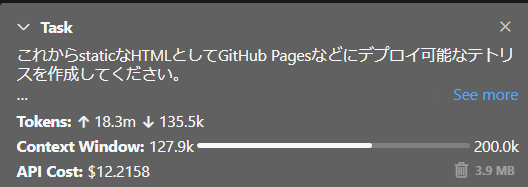
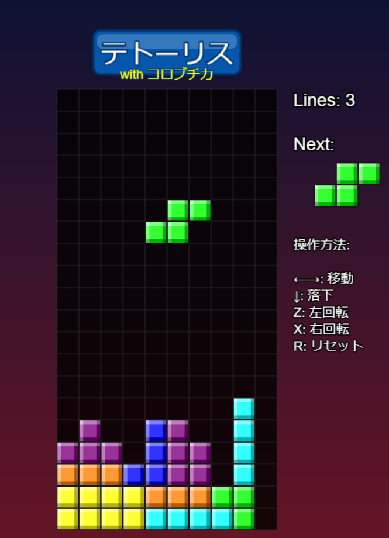

# Clineを検証するテスト
利用APIは Claude-3.7  
かかった費用は 12.21ドル  



## 作成物



[Phaser](https://phaser.io/)を使って作成された、テトリスライクなゲームです。

## 作成指示

```
## 利用する技術スタック

実行プラットフォーム Node.js

プログラミング言語 TypeScript

ゲームエンジン Phaser

## 利用するテンプレート

npm create @phaserjs/game@latest

以上のコマンドで導入されるテンプレート

## テトリスの仕様

- 標準的な10x20のマス
- 標準的な7つのテトリミノ。色も標準のもの。
- カーソルキー左右での移動
- カーソルキー下での落下
- zキーでの左回転、xキーでの右回転
- 操作方法の説明
- 消した列の数をカウントする機能
- ゲームオーバーがある
- rキーでのリセット
- ラインが消える際の視覚的なエフェクトとサウンド
- キュートでポップな今風のゲームのデザイン

以上で実装をお願いします。

また、具体的なTypeScriptの実装方針やテストの行い方、ドメインの実装法などは ディレクトリ内の.clienruleを参照するようにしてください。
```

## 追加指示

```
以下の不具合を直してください。

- テトリミノが一度描画して移動した後ずっと残ったままになっています。
- zとxで回転しません、代わりにrで回転します。
- rで最初からやり直すリセットが実装されていません
- オープニングタイトルのPhaserという文字は不要です。

-----

以下の不具合修正、追加要件を実装してください。

- タイトル画面からなにかキーを押すとテトリスが始まるようにしてください。
- zとxでの回転が落下中二度適用されてしまうことを修正してください。
- テトリミノのブロックが現在テキストが入ったブロックとなっています。つやのあるきれいなブロックにしてください。
- GitHubにあげるための.gitignoreをルートディレクトリに作成してください。
- このテトリスの仕様をや遊び方を書いたREADME.mdをルートディレクトリに作成してください。
- README.mdにGitHub Pagesへの公開の仕方や、ビルドの仕方、公開ディレクトリの設定の仕方などを記述してください。


-----

以下の不具合修正、追加要件を実装してください。

- ゲーム開始時のロゴをゲームデザインとして洗練されたものにしてください。
- ゲーム実行時の上部のテトリスを今の色調にあったかっこいいロゴにしてください。
- ゲーム時のサウンドが実装されていません。実装してください。

-----

以下の不具合修正、追加要件を実装してください。

- 残念ながらゲーム実行時のサウンドが鳴りません。修正してください。
- ラインが消えるときとテトリミノが地面に付いた瞬間に綺麗なアニメーションエフェクト表示されるようにしてください。


-----

以下の不具合修正、追加要件を実装してください。

- 残念ながらゲーム実行時のサウンドもなりません。
- 残念ながらラインが消えるときとテトリミノが地面に付いた瞬間に綺麗なアニメーションエフェクト表示されません。

-----
ちなみに起動コマンドは、

cd .\my-phaser-game\
npm run dev

です。覚えるようにしてください。


-----
以下の不具合修正、追加要件を実装してください。

- なぜか地面設置時のエフェクトが画面登場時に表示されててしまっています。ちゃんと設置時に起こるようにしてください。
- ブラウザから音は再生されているようですが、音が聞こえてきません。サウンドがちゃんとなるように修正してください。

-----
以下の不具合修正、追加要件を実装してください。

- なぜか地面設置時のエフェクトが二度目以降の画面登場時に表示されててしまっています。次の登場まで時間ラグがあってもいいので設置時にパーティクルが表示されるように修正してください。
- サウンドのオンオフ機能を実装してください。
- プレイ時にテトリス調の楽曲のBGMが流れるようにしてください。
- また、オープニング画面で音が鳴ることをあらかじめ警告するようにしてください。

-----
以下の不具合修正、追加要件を実装してください。

- 残念ながらてテトリス調の楽曲のBGMが流れていません
- Mでのサウンドオンオフ、BでのBGMオンオフが効きません
- オープニングタイトル画面及びテトリスプレイ時の背景が、アニメーションでグラデーションし、ゲームRETROWABEの夕日のようなかっこいい見た目にしてください

-----
以下の不具合修正、追加要件を実装してください。

- テトリス調のBGMはまだ流れません。修正してください。
- キーを連続入力するとサウンドが聞こえなくなる不具合を修正してください。
- RETROWABEの夕日のようなかっこいい見た目は思ったよりダサかったので、夕日色のグラデーションがアニメーションするだけの背景としてください。

-----
以下の不具合修正、追加要件を実装してください。

- 残念ながらキーを連続入力するとサウンドが消えてしまう不具合が直っておません。修正してください。

------
以下の不具合修正、追加要件を実装してください。

- テトリス tetrisという文言をそのまま使うと著作権侵害になってしまうので、テトーリス with コロブチカというカタカナ表記にするように修正してください。
- ラインが消える際のサウンドを1列、2列、3列、4列とそれぞれ別にして列の数が増えるたびに極端に派手なサウンドで表現していってください。

----
以下の不具合修正、追加要件を実装してください。

- GitHub管理には、clien-studyフォルダ自体を格納するつもりなので、.gitignoreをルートディレクトリに書いてください。
```
